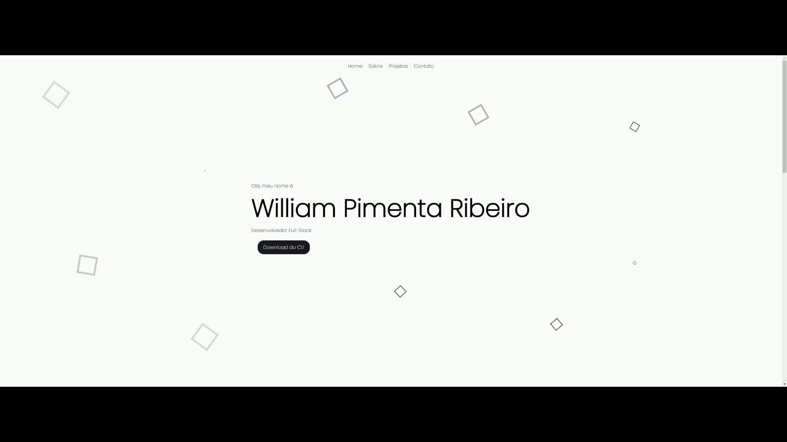

# Portfolio

Primeiro projeto criado em react aonde irei atualizá-lo de acordo com minha evolução, nele desenvolvi minha habilidade react utilizando vários componentes para divisão do código.
Uma maneira que usei para criar o carrossel foi utilizando do swiper.

[Teste em tempo real](https://portfolio-git-main-williamribeir0s-projects.vercel.app/)

# Responsividade

<!-- 

 -->
