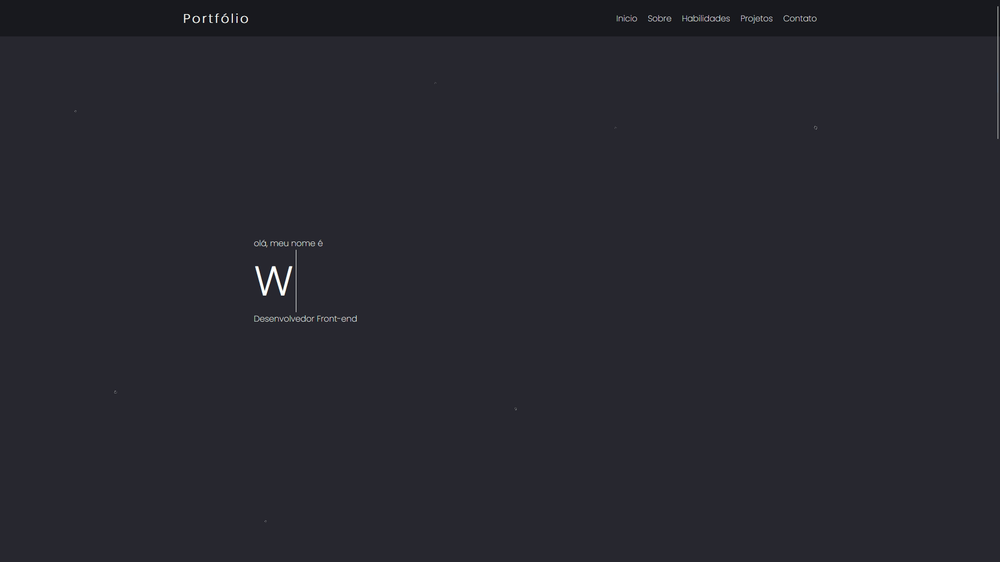

# Portfolio

Primeiro projeto criado em react aonde irei atualizá-lo de acordo com minha evolução, nele desenvolvi minha habilidade react utilizando vários componentes para divisão do código.
uma maneira que usei para criar o carrossel foi utilizando do swiper.

# Projeto ainda está faltando adicionar responsividade!!

[Teste em tempo real](https://portfolio-six-chi-83.vercel.app/)

